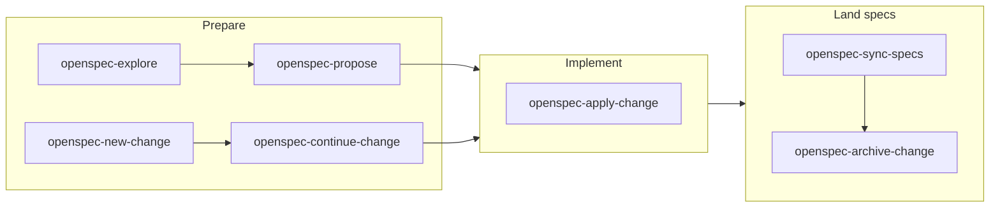

# OpenSpec workflows

How to move an OpenSpec **change** through its states in this repo. For file layout, SHALL/MUST
phrasing, and when a spec is required, see [`openspec-requirements.md`](./openspec-requirements.md).

The step-by-step procedures live in the generated skills under [`.agents/skills/`](../../.agents/skills/).
This page is **which skill to use and when**. Do not hand-edit those `SKILL.md` files — they are
generated from the pinned OpenSpec CLI (`generatedBy` in the frontmatter). Cloud-provider conventions
are injected via [`openspec/config.yaml`](../../openspec/config.yaml). After a CLI bump, regenerate with
`make gen-openspec-skills`. That writes exactly the seven skills below as `--tools agents` and does
**not** consult the global OpenSpec profile.

Do **not** run `openspec update` or `openspec init --tools claude`. `update` uses the global *core*
profile (propose/explore/apply/update/sync/archive) and would delete `new-change` / `continue-change`.
`.claude` is a symlink to `.agents`; `--tools claude` would write through that link and fight the
`agents` tree.

GitHub Agentic Workflows (`change-factory`, `verify-openspec`) and the heavier
`openspec-implementation-loop` / `openspec-verify-change` skills land in later Phase 1–4 issues.

## Prepare

Goal: an apply-ready change under `openspec/changes/<id>/` with proposal, design, tasks, and delta specs.

| Skill | When to use |
|-------|-------------|
| [`openspec-explore`](../../.agents/skills/openspec-explore/SKILL.md) | Scope is fuzzy; investigate the codebase or compare approaches **without** implementing |
| [`openspec-propose`](../../.agents/skills/openspec-propose/SKILL.md) | You can describe the outcome in one pass and want all artifacts generated together |
| [`openspec-new-change`](../../.agents/skills/openspec-new-change/SKILL.md) | Scaffold the change directory first, then add artifacts incrementally |
| [`openspec-continue-change`](../../.agents/skills/openspec-continue-change/SKILL.md) | A change exists but is not yet apply-ready; create the next artifact in sequence |

Send the OpenSpec artifacts for review **before** implementation when the change has spec impact. The
proposal can be a PR that contains only `openspec/changes/<id>/`.

## Implement

| Skill | When to use |
|-------|-------------|
| [`openspec-apply-change`](../../.agents/skills/openspec-apply-change/SKILL.md) | Work the task list, tick checkboxes, keep code changes scoped to each task |

Validation while applying: `make lint`, `make build`, `make unit`. **Never** `make testacc` / `TF_ACC`
from the agent. Targeted acceptance tests are a human/Buildkite step — see [`testing.md`](./testing.md).

A later skill (`openspec-implementation-loop`) will wrap apply with review, push, and PR monitoring.
Until then, apply locally and open the PR by hand.

## Land specs

After the code matches the change:

| Skill | When to use |
|-------|-------------|
| [`openspec-sync-specs`](../../.agents/skills/openspec-sync-specs/SKILL.md) | Merge delta specs into `openspec/specs/` without archiving yet |
| [`openspec-archive-change`](../../.agents/skills/openspec-archive-change/SKILL.md) | Implementation is done; sync if needed and move the change under `openspec/changes/archive/` |

Do not archive unimplemented behavior into `openspec/specs/`. A later `openspec-verify-change` skill
will check that the implementation matches the artifacts before archive.

## Validation

`make check-openspec` (`openspec validate --all`) checks structure and normative keywords. It does not
prove the Go code matches every requirement — that is review (and, later, verify).
