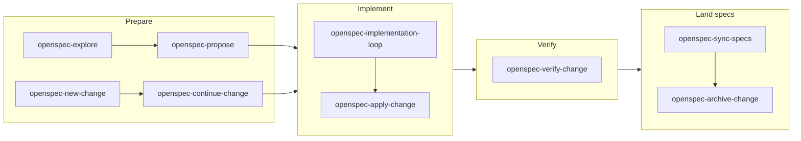

# OpenSpec workflows

How to move an OpenSpec **change** through its states in this repo. For file layout, SHALL/MUST
phrasing, and when a spec is required, see [`openspec-requirements.md`](./openspec-requirements.md).

The step-by-step procedures live in the skills under [`.agents/skills/`](../../.agents/skills/).
This page is **which skill to use and when**.

## Generated vs hand-written skills

The seven lifecycle skills (`explore`, `propose`, `new-change`, `continue-change`, `apply-change`,
`sync-specs`, `archive-change`) are **generated** from the pinned OpenSpec CLI (`generatedBy` in
the frontmatter). Do not hand-edit those `SKILL.md` files. Cloud-provider conventions are injected
via [`openspec/config.yaml`](../../openspec/config.yaml). After a CLI bump, regenerate with
`make gen-openspec-skills`. That writes those seven skills as `--tools agents` and does **not**
consult the global OpenSpec profile.

Two heavier skills are **hand-maintained** and listed in `scripts/gen-openspec-skills.mjs` so
regeneration does not delete them:

- [`openspec-implementation-loop`](../../.agents/skills/openspec-implementation-loop/SKILL.md)
- [`openspec-verify-change`](../../.agents/skills/openspec-verify-change/SKILL.md)

Do **not** run `openspec init` or `openspec update` in this repo (any `--tools` value). Both use
the global *core* profile (propose/explore/apply/update/sync/archive) and would delete
`new-change` / `continue-change`. `.claude` is a symlink to `.agents`; `--tools claude` would
write through that link and fight the `agents` tree.

Until the `use_npx_openspec` hook (Phase 1.9), invoke the pinned CLI as `npx openspec` or
`./node_modules/.bin/openspec` (after `make setup-openspec`). A bare `openspec` on PATH may be a
different version than `package.json`.

GitHub Agentic Workflows (`change-factory`, `verify-openspec`) land in later Phase 3–4 issues.
The local loop and verify skills below are the implementation/verify layer those workflows reuse.

## Prepare

Goal: an apply-ready change under `openspec/changes/<id>/` with proposal, design, tasks, and delta specs.

| Skill | When to use |
|-------|-------------|
| [`openspec-explore`](../../.agents/skills/openspec-explore/SKILL.md) | Scope is fuzzy; investigate the codebase or compare approaches **without** implementing |
| [`openspec-propose`](../../.agents/skills/openspec-propose/SKILL.md) | You can describe the outcome in one pass and want all artifacts generated together |
| [`openspec-new-change`](../../.agents/skills/openspec-new-change/SKILL.md) | Scaffold the change directory first, then add artifacts incrementally |
| [`openspec-continue-change`](../../.agents/skills/openspec-continue-change/SKILL.md) | A change exists but is not yet apply-ready; create the next artifact in sequence |

Send the OpenSpec artifacts for review **before** implementation when the change has spec impact. The
proposal can be a PR that contains only `openspec/changes/<id>/`.

## Implement

| Skill | When to use |
|-------|-------------|
| [`openspec-apply-change`](../../.agents/skills/openspec-apply-change/SKILL.md) | Work the task list by hand or with light agent help; tick checkboxes, keep code changes scoped to each task |
| [`openspec-implementation-loop`](../../.agents/skills/openspec-implementation-loop/SKILL.md) | Automated end-to-end loop around a single approved change: implement, review, push, watch GitHub Actions, optionally drive a PR |

The implementation loop triages the change into one of three execution strategies (inline,
single-implementor, per-task) and asks up front for a **delivery mode**:

- **Commit-only**: push to origin, watch GitHub Actions on the branch.
- **Pull request**: create a PR after the initial push, then monitor checks and reviews.

Strategy thresholds and review cadence are defined in the
[`openspec-implementation-loop`](../../.agents/skills/openspec-implementation-loop/SKILL.md) skill.

### Validation (all strategies)

The loop **always** runs:

- `env -u TF_ACC make docs-generate` when resource/data-source schemas, templates, or examples changed (before lint so new entity docs exist for `tfproviderdocs`, and before the generated-docs `git status`/commit check; `tfproviderdocs` does not fail merely because existing generated markdown is stale)
- `env -u TF_ACC make vendor` when `go.mod`/`go.sum` changed
- `env -u TF_ACC make lint`
- `env -u TF_ACC make build`
- `env -u TF_ACC make unit TEST=./... TESTARGS= TESTUNITARGS='-timeout 10m -race -cover -coverprofile=reports/c.out'`
- `env -u TF_ACC make check-openspec` when `openspec/` changed (it is not part of `make lint`)
- `env -u TF_ACC make install validate-examples` when examples or provider schemas changed
- `openspec-verify-change` (the orchestrator may run it inline; per-task defers it until every top-level task is complete)

The loop **never auto-runs** `make testacc` / `TF_ACC`. After `make unit`, if one or two existing
`TestAcc…` names cover the change, the orchestrator may **ask once** to run them
(`make testacc TEST_NAME='^TestAccMyThing$'` — anchored; `go test -run` is otherwise an unanchored
regexp. `TEST_NAME=TestAcc` is the full suite). If none exist, skip without asking. Default is skip
(human / Buildkite). It never
runs the full suite, never **auto-retries** acc on failure (after a code fix, one new ask, still
default skip), and never runs acc from `openspec-verify-change`. See [`testing.md`](./testing.md).

**Commit-only vs PR checks.** GitHub Actions `Go` runs on branch pushes. `OpenSpec CI` runs on
`master` and on **pull requests**, not on an arbitrary feature branch. In commit-only mode the
loop does not wait for `OpenSpec CI`; the local `make check-openspec` is the structural check.

### What the loop never does

- It never **archives** a change. Archiving is `openspec-archive-change` (or the later
  `verify-openspec` label).
- It never force-pushes unless you ask.
- It never starts a second change in the same run.
- It never **auto-runs** acceptance tests, never runs the full acc suite, and never auto-retries
  acc on failure. Targeted `TestAcc…` is opt-in only (one new ask after a code fix, default skip).

If the implementor blocks or the loop stalls, it pauses and asks rather than guessing.

## Verify

| Skill | When to use |
|-------|-------------|
| [`openspec-verify-change`](../../.agents/skills/openspec-verify-change/SKILL.md) | Run during the implementation loop (every strategy; per-task waits until all tasks are done) and before archiving; checks completeness, correctness, and coherence and produces a CRITICAL / WARNING / SUGGESTION report |

`openspec-verify-change` is also the skill the later `verify-openspec` CI gate will follow. It does
not archive. Unit tests and code paths are enough evidence; acc-only scenario coverage is a WARNING
that names the out-of-band `TestAcc…` case. The implementation loop treats verify **CRITICAL**
issues as push-blocking and **WARNINGs** as reported, not looped.

## Land specs

After the code matches the change and verify is clean:

| Skill | When to use |
|-------|-------------|
| [`openspec-sync-specs`](../../.agents/skills/openspec-sync-specs/SKILL.md) | Merge delta specs into `openspec/specs/` without archiving yet |
| [`openspec-archive-change`](../../.agents/skills/openspec-archive-change/SKILL.md) | Implementation is done; sync if needed and move the change under `openspec/changes/archive/` |

Do not archive unimplemented behavior into `openspec/specs/`. Run `openspec-verify-change` before
archive.

## Validation

`make check-openspec` (`openspec validate --all`) checks structure and normative keywords. It does not
prove the Go code matches every requirement — that is `openspec-verify-change` (and, later, the
`verify-openspec` label).
